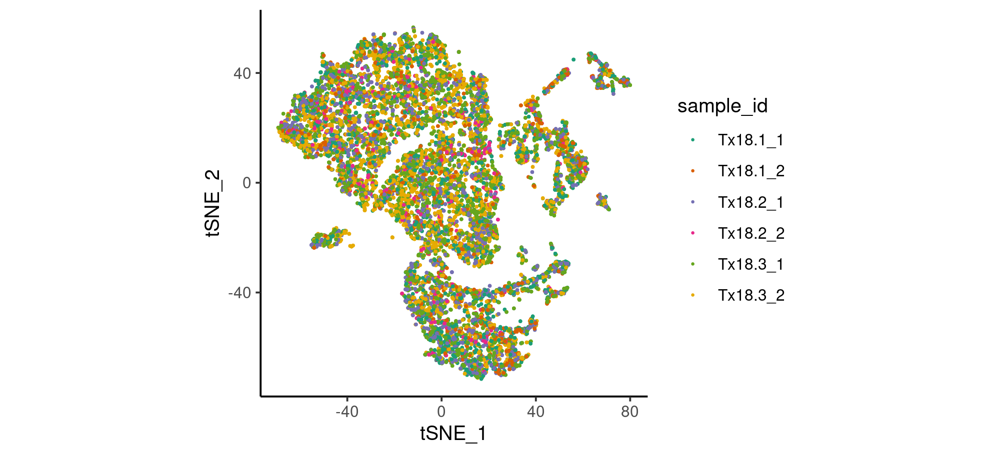
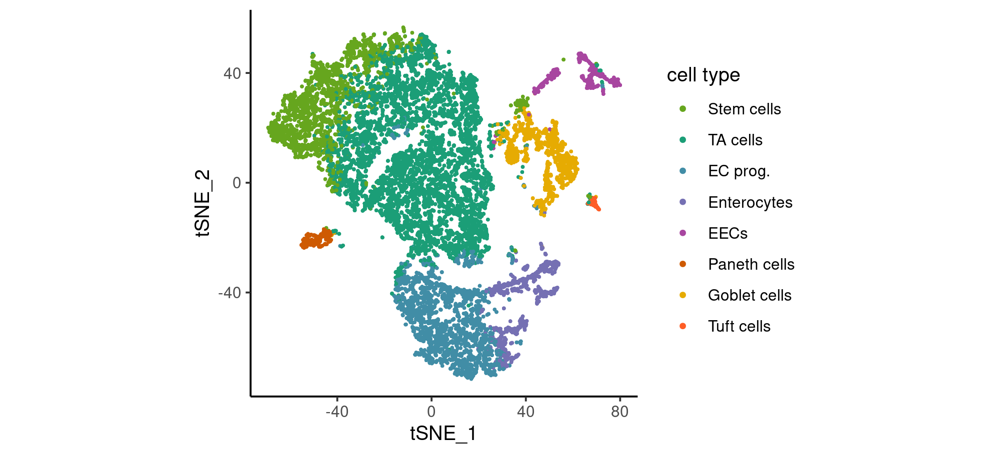
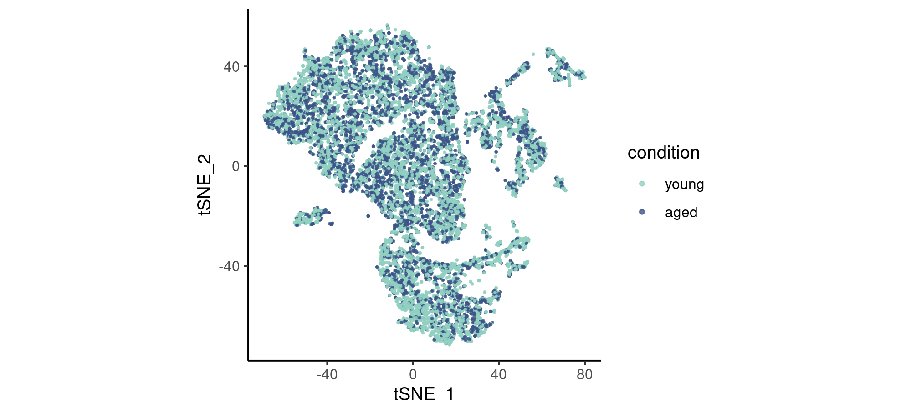
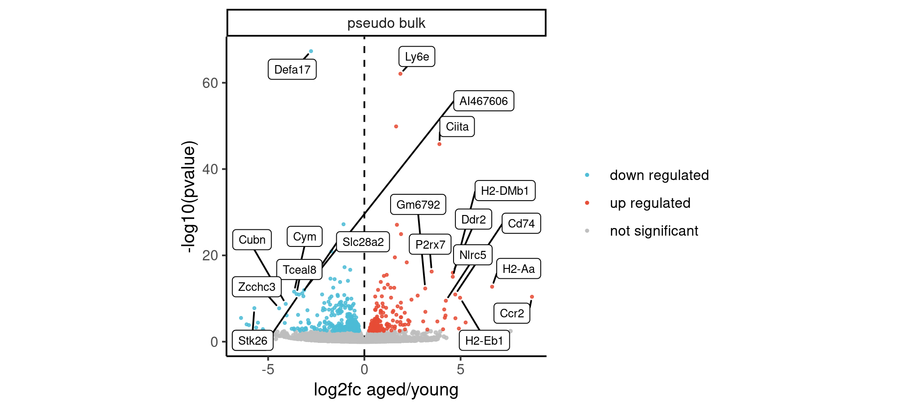

```
## NULL
```


<details><summary>Show revision, parameter and session details</summary>

<style>
  .main-container {
    max-width: 1658px !important;
  }
</style>
<div data-pagedtable="false">
  <script data-pagedtable-source type="application/json">
{"columns":[{"label":["parameter"],"name":[1],"type":["chr"],"align":["left"]},{"label":["value"],"name":[2],"type":["chr"],"align":["left"]}],"data":[{"1":"aggregated_data_dir","2":"\"processed_data\""},{"1":"processed_data_dir","2":"\"processed_data\""},{"1":"differential_expression_dir","2":"\"processed_data\""},{"1":"meta_data_dir","2":"\"analysis_pipeline\""},{"1":"results_dir","2":"\"results\""}],"options":{"columns":{"min":{},"max":[10]},"rows":{"min":[10],"max":[10]},"pages":{}}}
  </script>
</div>

```
## Git revision: 4bc7e84
## git diff:
##  M processed_data/DDE_samples_as_replicates.tsv.gz
##  M processed_data/DE_per_cell_type_conditioned_on_bulk.tsv.gz
##  M processed_data/DE_samples_as_replicates.tsv.gz
##  M processed_data/aggregated_expression.tsv.gz
##  M processed_data/dde_one_vs_sum_of_rest_dt.tsv.gz
##  M processed_data/meta_and_reductions.tsv.gz
##  M scRNAseq_figures_using_only_processed_data.Rmd
##  M scRNAseq_figures_using_raw_data.Rmd
## ?? analysis_pipeline/
## ?? results/
## ?? scRNAseq_figures_using_only_processed_data.html
## ?? scRNAseq_figures_using_only_processed_data.md
## ?? scRNAseq_figures_using_only_processed_data_files/
## ?? scRNAseq_figures_using_raw_data.html
## ?? scRNAseq_figures_using_raw_data.md
## ?? scRNAseq_figures_using_raw_data_files/
## ─ Session info ───────────────────────────────────────────────────────────────────────────────────────────────────────────────────────────────────────────────────────────────────────────────────────────────────────────
##  setting  value                       
##  version  R version 4.1.0 (2021-05-18)
##  os       CentOS Linux 7 (Core)       
##  system   x86_64, linux-gnu           
##  ui       X11                         
##  language (EN)                        
##  collate  en_US.UTF-8                 
##  ctype    en_US.UTF-8                 
##  tz       Europe/Berlin               
##  date     2021-12-01                  
## 
## ─ Packages ───────────────────────────────────────────────────────────────────────────────────────────────────────────────────────────────────────────────────────────────────────────────────────────────────────────────
##  package          * version    date       lib source             
##  abind              1.4-5      2016-07-21 [1] standard (@1.4-5)  
##  AnnotationDbi      1.56.1     2021-10-29 [1] standard (@1.56.1) 
##  assertthat         0.2.1      2019-03-21 [1] CRAN (R 4.1.0)     
##  backports          1.3.0      2021-10-27 [1] standard (@1.3.0)  
##  Biobase            2.54.0     2021-10-26 [1] standard (@2.54.0) 
##  BiocFileCache      2.2.0      2021-10-26 [1] standard (@2.2.0)  
##  BiocGenerics       0.40.0     2021-10-26 [1] standard (@0.40.0) 
##  biomaRt            2.50.0     2021-10-26 [1] standard (@2.50.0) 
##  Biostrings         2.62.0     2021-10-26 [1] standard (@2.62.0) 
##  bit                4.0.4      2020-08-04 [1] standard (@4.0.4)  
##  bit64              4.0.5      2020-08-30 [1] standard (@4.0.5)  
##  bitops             1.0-7      2021-04-24 [1] standard (@1.0-7)  
##  blob               1.2.2      2021-07-23 [1] standard (@1.2.2)  
##  broom              0.7.10     2021-10-31 [1] standard (@0.7.10) 
##  bslib              0.3.1      2021-10-06 [1] standard (@0.3.1)  
##  cachem             1.0.6      2021-08-19 [1] standard (@1.0.6)  
##  cellranger         1.1.0      2016-07-27 [1] standard (@1.1.0)  
##  cli                3.1.0      2021-10-27 [1] standard (@3.1.0)  
##  cluster            2.1.2      2021-04-17 [2] CRAN (R 4.1.0)     
##  codetools          0.2-18     2020-11-04 [2] CRAN (R 4.1.0)     
##  colorspace       * 2.0-2      2021-06-24 [1] standard (@2.0-2)  
##  cowplot            1.1.1      2020-12-30 [1] standard (@1.1.1)  
##  crayon             1.4.2      2021-10-29 [1] standard (@1.4.2)  
##  curl               4.3.2      2021-06-23 [1] standard (@4.3.2)  
##  data.table       * 1.14.2     2021-09-27 [1] standard (@1.14.2) 
##  DBI                1.1.1      2021-01-15 [1] standard (@1.1.1)  
##  dbplyr             2.1.1      2021-04-06 [1] standard (@2.1.1)  
##  deldir             1.0-6      2021-10-23 [1] standard (@1.0-6)  
##  digest             0.6.28     2021-09-23 [1] standard (@0.6.28) 
##  dplyr            * 1.0.7      2021-06-18 [1] standard (@1.0.7)  
##  ellipsis           0.3.2      2021-04-29 [1] standard (@0.3.2)  
##  evaluate           0.14       2019-05-28 [1] standard (@0.14)   
##  fansi              0.5.0      2021-05-25 [1] standard (@0.5.0)  
##  farver             2.1.0      2021-02-28 [1] standard (@2.1.0)  
##  fastmap            1.1.0      2021-01-25 [1] standard (@1.1.0)  
##  filelock           1.0.2      2018-10-05 [1] CRAN (R 4.1.0)     
##  fitdistrplus       1.1-6      2021-09-28 [1] standard (@1.1-6)  
##  forcats          * 0.5.1      2021-01-27 [1] standard (@0.5.1)  
##  fs                 1.5.0      2020-07-31 [1] standard (@1.5.0)  
##  future             1.23.0     2021-10-31 [1] standard (@1.23.0) 
##  future.apply       1.8.1      2021-08-10 [1] standard (@1.8.1)  
##  gamlss             5.3-4      2021-03-31 [1] standard (@5.3-4)  
##  gamlss.data        6.0-1      2021-03-18 [1] standard (@6.0-1)  
##  gamlss.dist        5.3-2      2021-03-09 [1] standard (@5.3-2)  
##  gamlss.tr          5.1-7      2020-07-13 [1] standard (@5.1-7)  
##  generics           0.1.1      2021-10-25 [1] standard (@0.1.1)  
##  GenomeInfoDb       1.30.0     2021-10-26 [1] standard (@1.30.0) 
##  GenomeInfoDbData   1.2.7      2021-11-02 [1] standard (@1.2.7)  
##  ggforce            0.3.3      2021-03-05 [1] standard (@0.3.3)  
##  ggplot2          * 3.3.5      2021-06-25 [1] standard (@3.3.5)  
##  ggrepel            0.9.1      2021-01-15 [1] standard (@0.9.1)  
##  ggridges           0.5.3      2021-01-08 [1] standard (@0.5.3)  
##  globals            0.14.0     2020-11-22 [1] standard (@0.14.0) 
##  glue               1.5.0      2021-11-07 [1] standard (@1.5.0)  
##  goftest            1.2-3      2021-10-07 [1] standard (@1.2-3)  
##  gridExtra          2.3        2017-09-09 [1] standard (@2.3)    
##  gtable             0.3.0      2019-03-25 [1] standard (@0.3.0)  
##  haven              2.4.3      2021-08-04 [1] standard (@2.4.3)  
##  hms                1.1.1      2021-09-26 [1] standard (@1.1.1)  
##  htmltools          0.5.2      2021-08-25 [1] standard (@0.5.2)  
##  htmlwidgets        1.5.4      2021-09-08 [1] standard (@1.5.4)  
##  httpuv             1.6.3      2021-09-09 [1] standard (@1.6.3)  
##  httr               1.4.2      2020-07-20 [1] standard (@1.4.2)  
##  ica                1.0-2      2018-05-24 [1] standard (@1.0-2)  
##  igraph             1.2.8      2021-11-07 [1] standard (@1.2.8)  
##  IRanges            2.28.0     2021-10-26 [1] standard (@2.28.0) 
##  irlba              2.3.3      2019-02-05 [1] standard (@2.3.3)  
##  jquerylib          0.1.4      2021-04-26 [1] standard (@0.1.4)  
##  jsonlite           1.7.2      2020-12-09 [1] standard (@1.7.2)  
##  KEGGREST           1.34.0     2021-10-26 [1] standard (@1.34.0) 
##  KernSmooth         2.23-20    2021-05-03 [2] CRAN (R 4.1.0)     
##  knitr              1.36       2021-09-29 [1] standard (@1.36)   
##  later              1.3.0      2021-08-18 [1] standard (@1.3.0)  
##  lattice            0.20-45    2021-09-22 [1] standard (@0.20-45)
##  lazyeval           0.2.2      2019-03-15 [1] standard (@0.2.2)  
##  leiden             0.3.9      2021-07-27 [1] CRAN (R 4.1.0)     
##  lifecycle          1.0.1      2021-09-24 [1] standard (@1.0.1)  
##  listenv            0.8.0      2019-12-05 [1] standard (@0.8.0)  
##  lmtest             0.9-39     2021-11-07 [1] standard (@0.9-39) 
##  lubridate          1.8.0      2021-10-07 [1] standard (@1.8.0)  
##  magrittr           2.0.1      2020-11-17 [1] standard (@2.0.1)  
##  MASS               7.3-54     2021-05-03 [2] CRAN (R 4.1.0)     
##  Matrix             1.3-4      2021-06-01 [2] CRAN (R 4.1.0)     
##  matrixStats        0.61.0     2021-09-17 [1] standard (@0.61.0) 
##  memoise            2.0.0      2021-01-26 [1] standard (@2.0.0)  
##  mgcv               1.8-38     2021-10-06 [1] standard (@1.8-38) 
##  mime               0.12       2021-09-28 [1] standard (@0.12)   
##  miniUI             0.1.1.1    2018-05-18 [1] standard (@0.1.1.1)
##  modelr             0.1.8      2020-05-19 [1] standard (@0.1.8)  
##  munsell            0.5.0      2018-06-12 [1] standard (@0.5.0)  
##  nlme               3.1-153    2021-09-07 [1] standard (@3.1-153)
##  parallelly         1.28.1     2021-09-09 [1] standard (@1.28.1) 
##  patchwork        * 1.1.1      2020-12-17 [1] standard (@1.1.1)  
##  pbapply            1.5-0      2021-09-16 [1] standard (@1.5-0)  
##  pillar             1.6.4      2021-10-18 [1] standard (@1.6.4)  
##  pkgconfig          2.0.3      2019-09-22 [1] standard (@2.0.3)  
##  plotly             4.10.0     2021-10-09 [1] standard (@4.10.0) 
##  plyr               1.8.6      2020-03-03 [1] standard (@1.8.6)  
##  png                0.1-7      2013-12-03 [1] standard (@0.1-7)  
##  polyclip           1.10-0     2019-03-14 [1] standard (@1.10-0) 
##  prettyunits        1.1.1      2020-01-24 [1] standard (@1.1.1)  
##  progress           1.2.2      2019-05-16 [1] CRAN (R 4.1.0)     
##  promises           1.2.0.1    2021-02-11 [1] standard (@1.2.0.1)
##  purrr            * 0.3.4      2020-04-17 [1] standard (@0.3.4)  
##  R6                 2.5.1      2021-08-19 [1] standard (@2.5.1)  
##  RANN               2.6.1      2019-01-08 [1] standard (@2.6.1)  
##  rappdirs           0.3.3      2021-01-31 [1] standard (@0.3.3)  
##  RColorBrewer       1.1-2      2014-12-07 [1] standard (@1.1-2)  
##  Rcpp               1.0.7      2021-07-07 [1] standard (@1.0.7)  
##  RcppAnnoy          0.0.19     2021-07-30 [1] standard (@0.0.19) 
##  RCurl              1.98-1.5   2021-09-17 [1] standard (@1.98-1.)
##  readr            * 2.0.2      2021-09-27 [1] standard (@2.0.2)  
##  readxl             1.3.1      2019-03-13 [1] standard (@1.3.1)  
##  reprex             2.0.1      2021-08-05 [1] standard (@2.0.1)  
##  reshape2           1.4.4      2020-04-09 [1] standard (@1.4.4)  
##  reticulate         1.22       2021-09-17 [1] standard (@1.22)   
##  rlang              0.4.12     2021-10-18 [1] standard (@0.4.12) 
##  rmarkdown          2.11       2021-09-14 [1] standard (@2.11)   
##  ROCR               1.0-11     2020-05-02 [1] standard (@1.0-11) 
##  rpart              4.1-15     2019-04-12 [2] CRAN (R 4.1.0)     
##  rprojroot          2.0.2      2020-11-15 [1] standard (@2.0.2)  
##  RSQLite            2.2.8      2021-08-21 [1] standard (@2.2.8)  
##  rstudioapi         0.13       2020-11-12 [1] standard (@0.13)   
##  Rtsne              0.15       2018-11-10 [1] standard (@0.15)   
##  rvest              1.0.2      2021-10-16 [1] standard (@1.0.2)  
##  S4Vectors          0.32.0     2021-10-26 [1] standard (@0.32.0) 
##  sass               0.4.0      2021-05-12 [1] standard (@0.4.0)  
##  scales             1.1.1      2020-05-11 [1] standard (@1.1.1)  
##  scattermore        0.7        2020-11-24 [1] standard (@0.7)    
##  schelpr          * 0.0.9017   2021-11-30 [1] local              
##  sctransform        0.3.2      2020-12-16 [1] standard (@0.3.2)  
##  sessioninfo        1.1.1      2018-11-05 [2] CRAN (R 4.1.0)     
##  Seurat             4.0.5      2021-10-17 [1] standard (@4.0.5)  
##  SeuratObject       4.0.3      2021-11-10 [1] standard (@4.0.3)  
##  shiny              1.7.1      2021-10-02 [1] standard (@1.7.1)  
##  sir              * 0.0.0.9011 2021-11-26 [1] local              
##  spatstat.core      2.3-1      2021-11-02 [1] standard (@2.3-1)  
##  spatstat.data      2.1-0      2021-03-21 [1] standard (@2.1-0)  
##  spatstat.geom      2.3-0      2021-10-09 [1] standard (@2.3-0)  
##  spatstat.sparse    2.0-0      2021-03-16 [1] standard (@2.0-0)  
##  spatstat.utils     2.2-0      2021-06-14 [1] standard (@2.2-0)  
##  stringi            1.7.5      2021-10-04 [1] standard (@1.7.5)  
##  stringr          * 1.4.0      2019-02-10 [1] standard (@1.4.0)  
##  survival           3.2-13     2021-08-24 [1] standard (@3.2-13) 
##  tensor             1.5        2012-05-05 [1] standard (@1.5)    
##  tibble           * 3.1.6      2021-11-07 [1] standard (@3.1.6)  
##  tidyr            * 1.1.4      2021-09-27 [1] standard (@1.1.4)  
##  tidyselect         1.1.1      2021-04-30 [1] standard (@1.1.1)  
##  tidyverse        * 1.3.1      2021-04-15 [1] standard (@1.3.1)  
##  tweenr             1.0.2      2021-03-23 [1] standard (@1.0.2)  
##  tzdb               0.2.0      2021-10-27 [1] standard (@0.2.0)  
##  utf8               1.2.2      2021-07-24 [1] standard (@1.2.2)  
##  uwot               0.1.10     2020-12-15 [1] standard (@0.1.10) 
##  vctrs              0.3.8      2021-04-29 [1] standard (@0.3.8)  
##  viridisLite        0.4.0      2021-04-13 [1] standard (@0.4.0)  
##  withr              2.4.2      2021-04-18 [1] standard (@2.4.2)  
##  xfun               0.27       2021-10-18 [1] standard (@0.27)   
##  XML                3.99-0.8   2021-09-17 [1] standard (@3.99-0.)
##  xml2               1.3.2      2020-04-23 [1] standard (@1.3.2)  
##  xtable             1.8-4      2019-04-21 [1] standard (@1.8-4)  
##  XVector            0.34.0     2021-10-26 [1] standard (@0.34.0) 
##  yaml               2.2.1      2020-02-01 [1] standard (@2.2.1)  
##  zlibbioc           1.40.0     2021-10-26 [1] standard (@1.40.0) 
##  zoo                1.8-9      2021-03-09 [1] standard (@1.8-9)  
## 
## [1] /home/gleixner/R/x86_64-pc-linux-gnu-library/4.1.0b
## [2] /software/r/4.1.0/lib64/R/library
```


</details>

###### load helper functions

```{.r .fold-hide}
sgi_blue    = '#5087C8'
sgi_yellow1 = '#F2EE35'
sgi_yellow2 = '#FED98E'
b110_grey   = '#808080'
b110_grey_light   = '#909090'
b110_transparent_black = ggplot2::alpha('#000000', 0.5)
google_red = '#dd4b39'
google_green = '#0F9D58'
google_yellow = '#F4B400'
google_blue = '#4285F4'
b110_colors <- c(sgi_blue, sgi_yellow1, sgi_yellow2, b110_grey, b110_grey_light, b110_transparent_black, google_red, google_green, google_yellow, google_blue)
legend_dot_size <- 1

maja_red <- alpha('#E64B35CC', 0.8)
maja_blue <- alpha('#4DBBD5CC', 0.8)
maja_gray <- alpha('gray', 0.8)

labeller_set <- function(width = Inf, ...) {
  if (width == Inf) {
    labeller(set = labels_of_set, ...) # returned
  } else {
    wrapped_labels_of_set <- stringr::str_wrap(labels_of_set, width = width)
    names(wrapped_labels_of_set)  <- levels_of_set
    labeller(set = wrapped_labels_of_set, ...)  # returned
  }
}

levels_of_cell_type <- c("pseudo bulk", "dead cells", "Stem",       "TA",       "Enterocyte Progenitor", "Enterocyte",  "EEC",     "Paneth",       "Goblet & Paneth",         "Goblet",       "Tuft"      )
labels_of_cell_type <- c("pseudo bulk", "dead cells", "Stem cells", "TA cells", "EC prog.",              "Enterocytes", "EECs",    "Paneth cells", "Goblet &\nPaneth cells",  "Goblet cells", "Tuft cells")
colors_of_cell_type <- c("#303030",     "#303030",    "#66a61e",    "#1b9e77",  "#418DA6",               "#7570b3",     "#a846a0", "#ce5a02",      "#a6761d",                 "#e6ab02",      "#FE5D26"   )  # old tuft: e7298a #E53D00
names(colors_of_cell_type) <- levels_of_cell_type

scale_x_cell_type <- function(
  name = "cell type",
  breaks = levels_of_cell_type,
  labels = labels_of_cell_type,
  limits = function(x) levels_of_cell_type[levels_of_cell_type %in% x],
  guide = guide_axis(
    #n.dodge=2,
    angle = 45,
    title = element_blank()),
  ...
) scale_x_discrete(name = name, breaks = breaks, labels = labels, guide = guide, limits = limits, ...)

scale_y_cell_type <- function(
  name = "cell type",
  breaks = rev(levels_of_cell_type),
  labels = rev(labels_of_cell_type),
  limits = function(x) rev(levels_of_cell_type[levels_of_cell_type %in% x]),
  guide = guide_axis(
    #n.dodge=2,
    #angle = 45,
    title = element_blank()),
  ...
) scale_y_discrete(name = name, breaks = breaks, labels = labels, guide = guide, limits = limits, ...)

scale_color_cell_type <- function(
  name = "cell type",
  breaks = levels_of_cell_type,
  labels = labels_of_cell_type,
  values = colors_of_cell_type,
  limits = identity,
  na.value = "#808080",
  guide = guide_legend(override.aes = list(size = legend_dot_size)),
  ...
) scale_color_manual(
  name = name,
  breaks = breaks,
  limits = limits,
  labels = labels,
  values = values,
  na.value = na.value,
  guide = guide,
  ...
)

scale_fill_cell_type <- function(
  name = "cell type",
  breaks = levels_of_cell_type,
  labels = labels_of_cell_type,
  values = colors_of_cell_type,
  limits = identity,
  na.value = "#808080",
  guide = guide_legend(override.aes = list(size = legend_dot_size)),
  ...
) scale_fill_manual(
  name = name,
  breaks = breaks,
  limits = limits,
  labels = labels,
  values = values,
  na.value = na.value,
  guide = guide,
  ...
)

scale_x_age <- function(..., limits = c("young", "aged")) scale_x_discrete(..., limits = limits)

age_colors <- c(young = "#91D1C2CC", aged = "#3C5488CC")
age_colors_light <- c(young = "#91D1C2CC", aged = "#8491B4CC")
age_colors_dark <- c(young = "#00A087CC", aged = "#3C5488CC")

scale_color_age <- function(..., limits = names(age_colors), values = age_colors, na.value = "grey", guide = guide_legend(override.aes = list(size = legend_dot_size))) ggplot2::scale_color_manual(..., limits = limits, values = values, na.value = na.value, guide = guide)
#scale_color_age_dark <- function(..., values = age_colors_dark) scale_color_age(..., values = values)

scale_fill_age <- function(..., limits = names(age_colors), values = age_colors, na.value = "grey", guide = guide_legend(override.aes = list(size = legend_dot_size))) ggplot2::scale_fill_manual(..., limits = limits, values = values, na.value = na.value, guide = guide)
scale_fill_age_dark <- function(..., values = age_colors_dark) scale_fill_age(..., values = values)

volcano_plot <- function(dt, alpha = 0.1, highlight = rank(padj)<=20, color = "black", box.padding = 0.25, label_size = 4, ...){
  if(missing(alpha)) message(paste0("FDR <= alpha = ", alpha))
  dt <- copy(dt)
  dt[padj > alpha, sir.class := "not significant"]
  dt[padj <= alpha & -log2FoldChange > 0, sir.class := "up regulated"]
  dt[padj <= alpha & -log2FoldChange < 0, sir.class := "down regulated"]
  labelled_subset_dt <- eval(substitute(copy(dt)[!(highlight), gene := ""]))
  
  dt %>% ggplot(aes(x = -log2FoldChange, y = -log10(pvalue))) +
    #geom_vline(xintercept = 0, linetype = "dotted") +
    geom_vline(xintercept = 0, linetype = "dashed") +
    ggrastr::rasterize(geom_point(data = dt[sir.class == "not significant",],aes(color = sir.class), size=0.5)) +
    geom_point(data = dt[sir.class != "not significant",], aes(color = sir.class), size=0.5) +
    scale_color_manual(breaks = c("down regulated", "up regulated", "not significant"), values = c(maja_blue, maja_red, maja_gray)) +
    guides(color = guide_legend(title = element_blank())) +
    labs(x = "log2fc aged/young") +
    # geom_vline(xintercept = c(0.5, -0.5), linetype = "dotted") + geom_hline(yintercept = 2, linetype = "dotted") +
    if(nrow(labelled_subset_dt)>0) ggrepel::geom_label_repel(aes(label = gene), data = labelled_subset_dt, color = color, min.segment.length = 0, size = label_size, box.padding = box.padding, max.overlaps = Inf, ...) else NULL +
    NULL
}

geom_cell <- function(..., size = 0.2, raster.dpi = 600) ggrastr::geom_point_rast(..., size = size, raster.dpi = raster.dpi)
```

###### load cell meta data

```r
dt <- fread(fs::path(processed_data_dir, "meta_and_reductions.tsv.gz"), sep= "\t")
```

###### tSNE_by_sample_id

```r
dt %>% ggplot(aes(x=tSNE_1, y=tSNE_2, color=sample_id)) +
  geom_cell() +
  # scale_color_sample_id() +
  NULL
```



###### tSNE_by_cell_type

```r
dt %>% ggplot(aes(x=tSNE_1, y=tSNE_2, color=cell_type)) +
  geom_cell() +
  scale_color_cell_type() +
  NULL
```



###### tSNE_by_age

```r
dt %>% ggplot(aes(x=tSNE_1, y=tSNE_2, color=condition)) +
  geom_cell() +
  scale_color_age() +
  NULL
```



###### cell numbers per type

```r
n_cells_dt <- dt[, .(n_cells = .N), by = .(cell_type, sample_id, treatment, condition)][, fraction_of_cells := n_cells/sum(n_cells), by = sample_id]

n_cells_dt[, mean_fraction_of_cells := mean(fraction_of_cells), by= cell_type][, rare := mean_fraction_of_cells < max(mean_fraction_of_cells)/4]

dodge_width <- 0.9
point_jitter_width <- 0.0
this_dodge <- function(width = dodge_width, reverse = TRUE, padding = 0.2) position_dodge2(width = width, reverse = reverse, padding = padding)

p <- n_cells_dt %>% ggplot(aes(x = cell_type, y = fraction_of_cells, color = condition)) +
  stat_summary(aes(fill = condition), fun.data = mean_se, geom = "col", position = this_dodge(), width = dodge_width) +
  stat_summary(aes(color = stage(condition, after_scale = colorspace::darken(color, 0.3))), fun.data = mean_se, geom = "errorbar", position = this_dodge(padding=1/3), width = dodge_width) +
  stat_summary(aes(group = interaction(cell_type, condition), color = stage(condition, after_scale = colorspace::darken(color, 0.3))), fun = mean, geom = "crossbar", position = this_dodge(), width = dodge_width) +
  geom_point(position = position_jitterdodge(point_jitter_width, dodge.width = dodge_width), aes(group = interaction(cell_type, forcats::fct_rev(condition)), fill=condition), color = "black") +
  labs(y = "fraction of cells per sample") +
  guides(color = "none") +
  scale_y_continuous(labels = scales::percent_format(accuracy = 1)) +
  scale_color_age() +
  scale_fill_age() +
  scale_x_cell_type() +
  theme(axis.title.x = element_blank()) +
  NULL
p
```


###### cell number proportion change

```r
n_cells_dt[, broom::tidy(t.test(log(fraction_of_cells)~condition, data = .SD)), by = cell_type][, .(relative_change_fraction_ci = pmax(1-exp(conf.low), exp(conf.high)-1)), by = cell_type][]
```

<div data-pagedtable="false">
  <script data-pagedtable-source type="application/json">
{"columns":[{"label":["cell_type"],"name":[1],"type":["chr"],"align":["left"]},{"label":["relative_change_fraction_ci"],"name":[2],"type":["dbl"],"align":["right"]}],"data":[{"1":"TA","2":"0.7180776"},{"1":"Enterocyte Progenitor","2":"0.4719565"},{"1":"Stem","2":"0.4257810"},{"1":"Goblet","2":"0.4343554"},{"1":"Enterocyte","2":"1.9474678"},{"1":"Tuft","2":"0.9260758"},{"1":"Paneth","2":"1253.9025609"},{"1":"EEC","2":"7.0369033"}],"options":{"columns":{"min":{},"max":[10]},"rows":{"min":[10],"max":[10]},"pages":{}}}
  </script>
</div>

```r
n_cells_dt[, broom::tidy(t.test(fraction_of_cells~condition, data = .SD)), by = cell_type
           ][, .(mean_fraction_young = estimate2, absolute_change_fraction_ci = pmax(abs(conf.low), abs(conf.high)), conf.low, conf.high, pval = p.value), by = cell_type
             ][, relative_change_fraction_ci := scales::percent_format(1)(absolute_change_fraction_ci/mean_fraction_young)
               ][, adj_pval := p.adjust(pval, method = "BH")][]
```

<div data-pagedtable="false">
  <script data-pagedtable-source type="application/json">
{"columns":[{"label":["cell_type"],"name":[1],"type":["chr"],"align":["left"]},{"label":["mean_fraction_young"],"name":[2],"type":["dbl"],"align":["right"]},{"label":["absolute_change_fraction_ci"],"name":[3],"type":["dbl"],"align":["right"]},{"label":["conf.low"],"name":[4],"type":["dbl"],"align":["right"]},{"label":["conf.high"],"name":[5],"type":["dbl"],"align":["right"]},{"label":["pval"],"name":[6],"type":["dbl"],"align":["right"]},{"label":["relative_change_fraction_ci"],"name":[7],"type":["chr"],"align":["left"]},{"label":["adj_pval"],"name":[8],"type":["dbl"],"align":["right"]}],"data":[{"1":"TA","2":"0.434973521","3":"0.25341372","4":"-0.12550651","5":"0.2534137185","6":"0.39127218","7":"58%","8":"0.4471682"},{"1":"Enterocyte Progenitor","2":"0.194674920","3":"0.11924314","4":"-0.11924314","5":"0.0416765153","6":"0.22831290","7":"61%","8":"0.4471682"},{"1":"Stem","2":"0.156770521","3":"0.05904767","4":"-0.02617175","5":"0.0590476732","6":"0.34308997","7":"38%","8":"0.4471682"},{"1":"Goblet","2":"0.088633698","3":"0.04805028","4":"-0.04805028","5":"0.0159989719","6":"0.22675750","7":"54%","8":"0.4471682"},{"1":"Enterocyte","2":"0.068563006","3":"0.08685719","4":"-0.08685719","5":"0.0436818702","6":"0.38265086","7":"127%","8":"0.4471682"},{"1":"Tuft","2":"0.005322376","3":"0.00666970","4":"-0.00666970","5":"-0.0002931934","6":"0.03910905","7":"125%","8":"0.3128724"},{"1":"Paneth","2":"0.017328852","3":"0.04738863","4":"-0.04738863","5":"0.0302539621","6":"0.34221794","7":"273%","8":"0.4471682"},{"1":"EEC","2":"0.033733107","3":"0.09542778","4":"-0.07347908","5":"0.0954277815","6":"0.68077168","7":"283%","8":"0.6807717"}],"options":{"columns":{"min":{},"max":[10]},"rows":{"min":[10],"max":[10]},"pages":{}}}
  </script>
</div>


# DEGs

###### unnamed-chunk-1

```r
de_single_cell_dt <- fread(fs::path(differential_expression_dir, "DE_samples_as_replicates.tsv.gz"), sep="\t")
de_single_cell_dt <- de_single_cell_dt[contrast == "condition_young_vs_aged"]
de_single_cell_dt[, gene_name := gene]
setnames(de_single_cell_dt, 
         old =  c("estimate", "stderror", "statistic", "p.value", "p.adjusted"),
         new = c("log2FoldChange", "lfcSE", "stat", "pvalue", "padj")
)

cell_types <- de_single_cell_dt[, sort(unique(cell_type))]
cell_types <- c(cell_types[cell_types %in% "pseudo bulk"], cell_types[!(cell_types %in% "pseudo bulk")])

de_single_cell_dt[is.na(padj), padj := 1]
```


###### visualize number of degs

```r
n_genes_differentially_expressed_per_celltype <- de_single_cell_dt[cell_type != "pseudo bulk"][padj<0.1][, .N , keyby = cell_type][levels_of_cell_type,][is.na(N), N := 0]
n_genes_differentially_expressed_per_celltype
de_single_cell_dt[cell_type != "pseudo bulk"] %>% ggplot(aes(x = cell_type, y = -log2FoldChange)) +
  ggrastr::rasterize(geom_jitter(color = "gray"), dpi = 600) +
  ggforce::geom_sina(aes(color = cell_type), data = de_single_cell_dt[cell_type != "pseudo bulk"][padj<0.1], scale="width") +
  labs(y = "log2 FC aged / young") +
  guides(color = "none") +
  geom_hline(yintercept = 0, color = "gray50", linetype="dashed") +
  scale_x_cell_type() +
  scale_color_cell_type() +
  theme(axis.title.x = element_blank(), aspect.ratio = 2/3) +
  NULL
```


```r
# ggsave("results/deg_count.pdf", width = 7.7, height = 3.5, bg = "transparent")
```


###### volcano

```r
n_highlight <- 20
volcano_plot(de_single_cell_dt[cell_type=="pseudo bulk",],
  highlight = rank(- (abs(log2FoldChange)-(lfcSE*qnorm(1-0.1*n_highlight/length(lfcSE)))))<=n_highlight, 
  label_size = 2.5, 
  force_pull = 5, 
  point.padding = 0.2,
  force = 70,
  #nudge_y = 10,
  color = "black",     # text color
  bg.color = "white", # shadow color
  bg.r = 0.2          # shadow radius
) +
  facet_wrap("cell_type") +
  NULL
```

```
## FDR <= alpha = 0.1
```

```
## Warning: Ignoring unknown parameters: bg.colour, bg.r
```



###### mhcII pval

```r
mhcII_features_dt <- fread(fs::path(meta_data_dir, "SI_feature_gene_lists.tsv"))[feature %in% "MHC class II"]
mhcII_features_dt <- de_single_cell_dt[mhcII_features_dt, on = .(gene = marker_gene_symbol)]

mhcII_features_dt[cell_type != "pseudo bulk"] %>%
  ggplot(aes(x = gene, y = cell_type, color = -log2FoldChange)) +
  geom_point(aes(size = -log10(padj))) +
  scale_size_area(expression("-log"[10]*"\n p"["adj."]), n.breaks = 3)+
  scale_y_cell_type() +
  scale_color_viridis_c(option = "inferno", direction = -1) +
  guides(color = guide_colorbar(expression("log"[2]*"FC")), x=guide_axis(angle=45)) +
  NULL
```

```
## Warning in grid.Call(C_textBounds, as.graphicsAnnot(x$label), x$x, x$y, : font metrics unknown for character 0xa

## Warning in grid.Call(C_textBounds, as.graphicsAnnot(x$label), x$x, x$y, : font metrics unknown for character 0xa

## Warning in grid.Call(C_textBounds, as.graphicsAnnot(x$label), x$x, x$y, : font metrics unknown for character 0xa

## Warning in grid.Call(C_textBounds, as.graphicsAnnot(x$label), x$x, x$y, : font metrics unknown for character 0xa

## Warning in grid.Call(C_textBounds, as.graphicsAnnot(x$label), x$x, x$y, : font metrics unknown for character 0xa

## Warning in grid.Call(C_textBounds, as.graphicsAnnot(x$label), x$x, x$y, : font metrics unknown for character 0xa

## Warning in grid.Call(C_textBounds, as.graphicsAnnot(x$label), x$x, x$y, : font metrics unknown for character 0xa

## Warning in grid.Call(C_textBounds, as.graphicsAnnot(x$label), x$x, x$y, : font metrics unknown for character 0xa

## Warning in grid.Call(C_textBounds, as.graphicsAnnot(x$label), x$x, x$y, : font metrics unknown for character 0xa

## Warning in grid.Call(C_textBounds, as.graphicsAnnot(x$label), x$x, x$y, : font metrics unknown for character 0xa

## Warning in grid.Call(C_textBounds, as.graphicsAnnot(x$label), x$x, x$y, : font metrics unknown for character 0xa

## Warning in grid.Call(C_textBounds, as.graphicsAnnot(x$label), x$x, x$y, : font metrics unknown for character 0xa

## Warning in grid.Call(C_textBounds, as.graphicsAnnot(x$label), x$x, x$y, : font metrics unknown for character 0xa

## Warning in grid.Call(C_textBounds, as.graphicsAnnot(x$label), x$x, x$y, : font metrics unknown for character 0xa

## Warning in grid.Call(C_textBounds, as.graphicsAnnot(x$label), x$x, x$y, : font metrics unknown for character 0xa

## Warning in grid.Call(C_textBounds, as.graphicsAnnot(x$label), x$x, x$y, : font metrics unknown for character 0xa

## Warning in grid.Call(C_textBounds, as.graphicsAnnot(x$label), x$x, x$y, : font metrics unknown for character 0xa

## Warning in grid.Call(C_textBounds, as.graphicsAnnot(x$label), x$x, x$y, : font metrics unknown for character 0xa

## Warning in grid.Call(C_textBounds, as.graphicsAnnot(x$label), x$x, x$y, : font metrics unknown for character 0xa

## Warning in grid.Call(C_textBounds, as.graphicsAnnot(x$label), x$x, x$y, : font metrics unknown for character 0xa

## Warning in grid.Call(C_textBounds, as.graphicsAnnot(x$label), x$x, x$y, : font metrics unknown for character 0xa

## Warning in grid.Call(C_textBounds, as.graphicsAnnot(x$label), x$x, x$y, : font metrics unknown for character 0xa

## Warning in grid.Call(C_textBounds, as.graphicsAnnot(x$label), x$x, x$y, : font metrics unknown for character 0xa

## Warning in grid.Call(C_textBounds, as.graphicsAnnot(x$label), x$x, x$y, : font metrics unknown for character 0xa

## Warning in grid.Call(C_textBounds, as.graphicsAnnot(x$label), x$x, x$y, : font metrics unknown for character 0xa

## Warning in grid.Call(C_textBounds, as.graphicsAnnot(x$label), x$x, x$y, : font metrics unknown for character 0xa

## Warning in grid.Call(C_textBounds, as.graphicsAnnot(x$label), x$x, x$y, : font metrics unknown for character 0xa

## Warning in grid.Call(C_textBounds, as.graphicsAnnot(x$label), x$x, x$y, : font metrics unknown for character 0xa

## Warning in grid.Call(C_textBounds, as.graphicsAnnot(x$label), x$x, x$y, : font metrics unknown for character 0xa

## Warning in grid.Call(C_textBounds, as.graphicsAnnot(x$label), x$x, x$y, : font metrics unknown for character 0xa

## Warning in grid.Call(C_textBounds, as.graphicsAnnot(x$label), x$x, x$y, : font metrics unknown for character 0xa

## Warning in grid.Call(C_textBounds, as.graphicsAnnot(x$label), x$x, x$y, : font metrics unknown for character 0xa

## Warning in grid.Call(C_textBounds, as.graphicsAnnot(x$label), x$x, x$y, : font metrics unknown for character 0xa

## Warning in grid.Call(C_textBounds, as.graphicsAnnot(x$label), x$x, x$y, : font metrics unknown for character 0xa

## Warning in grid.Call(C_textBounds, as.graphicsAnnot(x$label), x$x, x$y, : font metrics unknown for character 0xa

## Warning in grid.Call(C_textBounds, as.graphicsAnnot(x$label), x$x, x$y, : font metrics unknown for character 0xa

## Warning in grid.Call(C_textBounds, as.graphicsAnnot(x$label), x$x, x$y, : font metrics unknown for character 0xa

## Warning in grid.Call(C_textBounds, as.graphicsAnnot(x$label), x$x, x$y, : font metrics unknown for character 0xa

## Warning in grid.Call(C_textBounds, as.graphicsAnnot(x$label), x$x, x$y, : font metrics unknown for character 0xa

## Warning in grid.Call(C_textBounds, as.graphicsAnnot(x$label), x$x, x$y, : font metrics unknown for character 0xa

## Warning in grid.Call(C_textBounds, as.graphicsAnnot(x$label), x$x, x$y, : font metrics unknown for character 0xa

## Warning in grid.Call(C_textBounds, as.graphicsAnnot(x$label), x$x, x$y, : font metrics unknown for character 0xa

## Warning in grid.Call(C_textBounds, as.graphicsAnnot(x$label), x$x, x$y, : font metrics unknown for character 0xa

## Warning in grid.Call(C_textBounds, as.graphicsAnnot(x$label), x$x, x$y, : font metrics unknown for character 0xa

## Warning in grid.Call(C_textBounds, as.graphicsAnnot(x$label), x$x, x$y, : font metrics unknown for character 0xa

## Warning in grid.Call(C_textBounds, as.graphicsAnnot(x$label), x$x, x$y, : font metrics unknown for character 0xa

## Warning in grid.Call(C_textBounds, as.graphicsAnnot(x$label), x$x, x$y, : font metrics unknown for character 0xa

## Warning in grid.Call(C_textBounds, as.graphicsAnnot(x$label), x$x, x$y, : font metrics unknown for character 0xa
```

```
## Warning in grid.Call.graphics(C_text, as.graphicsAnnot(x$label), x$x, x$y, : font metrics unknown for character 0xa

## Warning in grid.Call.graphics(C_text, as.graphicsAnnot(x$label), x$x, x$y, : font metrics unknown for character 0xa
```


###### supplementary figure qc filtering

```r
dt %>% ggplot(aes(x=nCount_RNA, y=fraction_mito, color=sample_id)) +
  geom_cell() +
  facet_wrap("cell_type", nrow=2) +
  labs(x = "counts", y = "fraction of counts from mitochondrial genes") +
  theme(
    panel.grid.major.x = element_line(color="gray95", size = 0.3),
    panel.grid.minor.x = element_line(color="gray95", size = 0.1),
    panel.grid.major.y = element_line(color="gray95", size = 0.3),
    panel.grid.minor.y = element_line(color="gray95", size = 0.1)
  ) +
  schelpr::scale_x_log()+
  guides(color = guide_legend(override.aes = list(size = 1))) +
  NULL
```


###### inflammaging score tsne

```r
dt[, age := factor(condition, c("young", "aged"))]

p1 <- dt %>% ggplot(aes(x=tSNE_1, y=tSNE_2, color=inflammaging_score_scaled)) + 
  geom_cell() + 
  labs(color="inflammaging score") +
  NULL
p1 + facet_wrap("age") + scale_color_gradientn(colours = heatmaply::cool_warm(500), limits = c(0, 1))
```


```r
dt %>% ggplot(aes(x=tSNE_1, y=tSNE_2, color=rank(inflammaging_score_scaled)/length(inflammaging_score_scaled))) + 
  geom_cell() + 
  labs(color="inflammaging score\n(quantile normalized)") +
  NULL + facet_wrap("age") + scale_color_gradientn(colors = heatmaply::cool_warm(500), limits= c(0,1), labels=scales::percent_format())
```


###### inflammaging score

```r
dts <- dt[, .(inflammaging_score = mean(inflammaging_score), inflammaging_score_scaled = mean(inflammaging_score_scaled)), by = .(cell_type, condition, Tx_run_number, sample_id)]
dts_wide <- dcast(dts, cell_type + Tx_run_number ~ condition, value.var = c("inflammaging_score", "inflammaging_score_scaled"))
dts_wides <- dts_wide[, do.call(cbind, lapply(.SD, mean_cl_normal)), .SDcols = c("inflammaging_score_scaled_young", "inflammaging_score_scaled_aged"),  by= cell_type]

dts %>%
  ggplot(aes(x = inflammaging_score_scaled, y = cell_type, color = condition)) +
  xlab("inflammaging score") +
  #geom_line(aes(group = cell_type), color = "gray", size = 1) +
  #stat_summary(aes(group = stage(interaction(cell_type, condition), after_stat = cell_type)), geom = "line") +
  geom_segment(data = dts_wides, aes(x = inflammaging_score_scaled_young.y, xend = inflammaging_score_scaled_aged.y, yend = cell_type), color = "gray",  size = 1) +
  stat_summary(geom = "point", size = 5) +
  geom_point() +
  #geom_point(aes(x = cell_type_inflammaging_score), size = 2, alpha = 0.5) +
  #cowplot::theme_cowplot() +
  scale_color_age() +
  scale_y_cell_type() +
  NULL
```

```
## No summary function supplied, defaulting to `mean_se()`
```


